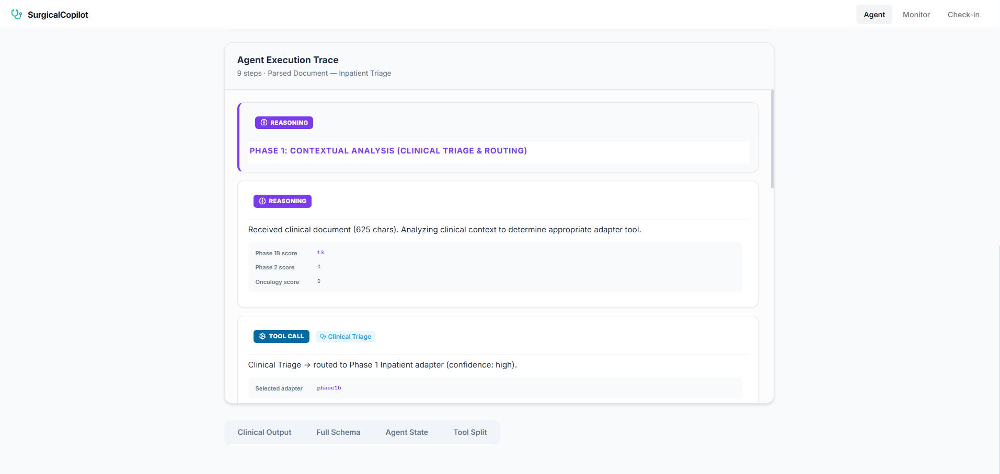
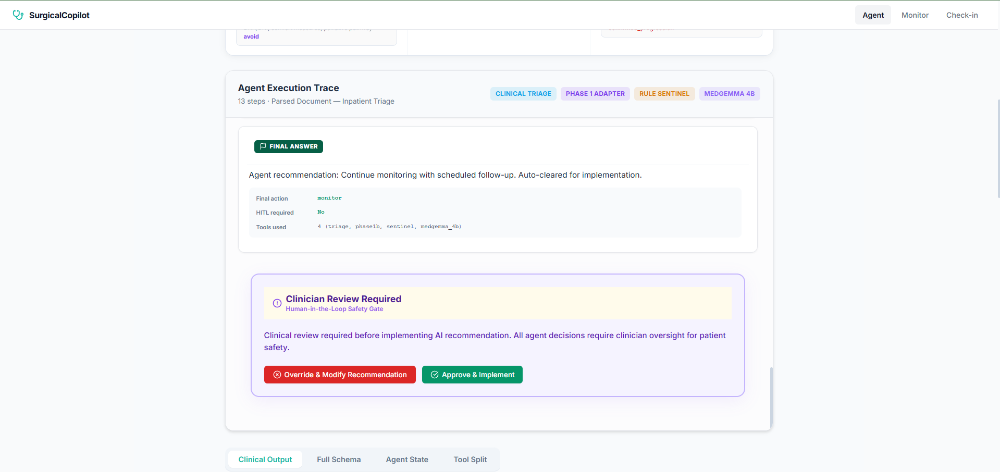
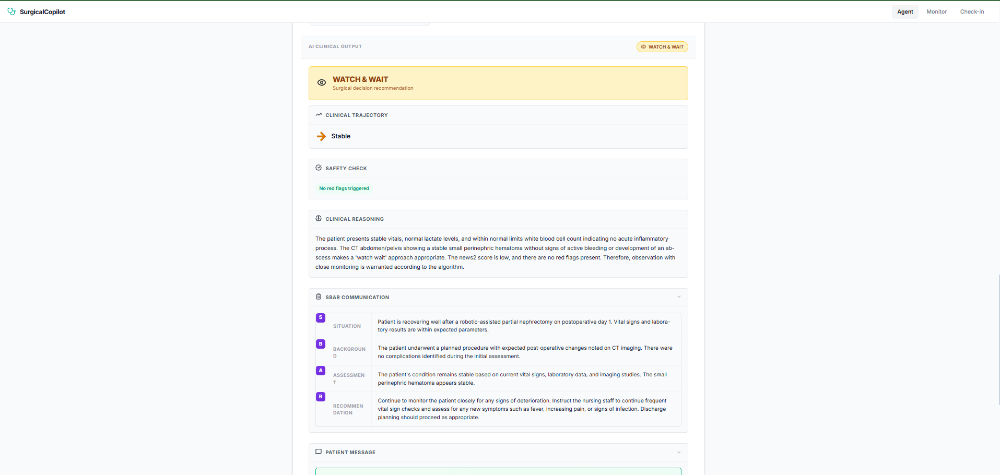
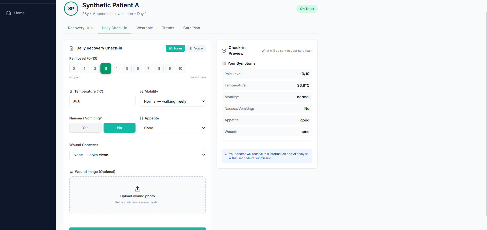

# Surgical Copilot - An AI copilot that watches over surgical patients from hospital bed to home recovery

A MedGemma-Powered Clinical Governance System for Surgical Decision Support.

## 🎯 Overview

Surgical Copilot provides real-time clinical decision support for:
- **Phase 1**: Inpatient post-operative monitoring
- **Phase 2**: Post-discharge remote patient monitoring  
- **Oncology**: Surveillance and follow-up care

## 🚀 Features

- **AI-Powered Triage**: Uses MedGemma-27B with LoRA adapters for clinical decision-making
- **Multimodal Analysis**: MedGemma-4B for wound photo analysis and enrichment
- **Real-time Monitoring**: WebSocket-based notifications and updates
- **Clinical Safety**: Built-in safety gates and human-in-the-loop mechanisms
- **SBAR Generation**: Automated clinical handoff documentation
- **Wearable Integration**: Passive signal analysis from patient devices

## ℹ️ Demo Application Boundaries

Please note that this repository is currently configured as a **UI and Concept Demonstration** for judging and evaluation purposes:
1. **No Authentication**: Login and logout flows are bypassed to allow seamless exploration of the interface.
2. **Unified Dashboard**: Both the Doctor Portal and Patient Portal are colocated on the same web application for ease of demonstration. In a production environment, these would be strictly separated with rigorous access controls.
3. **Mock Data Fallback**: If the MedGemma backend is unreachable or a GPU is unavailable, the application gracefully degrades to using static mock outputs to demonstrate the UI workflow. Real inference requires the backend service to be running with appropriate hardware.

## 🧠 Hugging Face Model Access

To run real inferences instead of the UI simulation, you will need access to the base MedGemma models and our custom LoRA adapters:
- **Base Text Model**: [google/medgemma-27b-text-it](https://huggingface.co/google/medgemma-27b)
- **Base Multimodal Model**: [google/medgemma-4b-it](https://huggingface.co/google/medgemma-4b)
- **Phase 1B Adapter**: [bobby07007/surgicalcopilot-phase1b-27b](https://huggingface.co/bobby07007/surgicalcopilot-phase1b-27b)
- **Phase 2 Adapter**: [bobby07007/surgicalcopilot-phase2-27b](https://huggingface.co/bobby07007/surgicalcopilot-phase2-27b)
- **Oncology Surveillance Adapter**: [bobby07007/surgicalcopilot-onco-27b](https://huggingface.co/bobby07007/surgicalcopilot-onco-27b)
## 📸 Live Inference Evidence (Real Runs)

These are screenshots from real inference runs in the deployed Surgical Copilot web app.

<table>
  <tr>
    <td align="center">
      
      <br/><sub>Phase routing + trace</sub>
    </td>
    <td align="center">
      
      <br/><sub>HITL safety gate</sub>
    </td>
  </tr>
  <tr>
    <td align="center">
      
      <br/><sub>WATCH &amp; WAIT output (Phase 1B)</sub>
    </td>
    <td align="center">
      
      <br/><sub>Daily check-in (Phase 2)</sub>
    </td>
  </tr>
</table>

**Full evidence pack**
- Screenshots index: [docs/evidence/images/SCREENSHOTS.md](docs/evidence/images/SCREENSHOTS.md)

## 📋 Prerequisites

- Python 3.9+
- Node.js 16+
- CUDA-capable GPU (for real inference)
- 40GB+ VRAM for full model deployment
- HuggingFace account with MedGemma access

## 🛠️ Installation

### 1. Clone the Repository
```bash
git clone https://github.com/yourusername/surgical-copilot.git
cd surgical-copilot
```

### 2. Backend Setup
```bash
cd backend
python -m venv venv
source venv/bin/activate  # On Windows: venv\Scripts\activate
pip install -r requirements.txt
```

### 3. Frontend Setup
```bash
cd ../frontend
npm install
```

### 4. Environment Configuration
```bash
cd backend
cp .env.example .env
# Edit .env with your configuration
```

Required environment variables:
- `HF_TOKEN`: Your HuggingFace token with MedGemma access
- `DEMO_MODE`: Set to `true` for demo mode (no GPU required)
- `MODEL_ID`: MedGemma model identifier
- `ADAPTER_*_PATH`: Paths to LoRA adapters (if using real inference)

## 🚦 Quick Start

### Demo Mode (No GPU Required)
```bash
# Backend
cd backend
export DEMO_MODE=true
python app/main.py

# Frontend (new terminal)
cd frontend
npm run dev
```

### Production Mode (GPU Required)
```bash
# Backend
cd backend

# Launch with MedGemma Base Model + Phase 1B/Phase 2/Onco LoRAs
DEMO_MODE=false \
HF_TOKEN="hf_YOUR_TOKEN_HERE" \
ADAPTER_PHASE1B_PATH="bobby07007/surgicalcopilot-phase1b-27b" \
ADAPTER_PHASE2_PATH="bobby07007/surgicalcopilot-phase2-27b" \
ADAPTER_ONCO_PATH="bobby07007/surgicalcopilot-onco-27b" \
python -m uvicorn app.main:app --host 0.0.0.0 --port 8000

# Frontend (new terminal)
cd frontend
npm run build
npm run preview
```

## 📁 Project Structure

```
surgical-copilot/
├── backend/
│   ├── app/
│   │   ├── main.py          # FastAPI application
│   │   ├── engine.py        # Model inference engine
│   │   ├── json_parser.py   # Response parsing
│   │   └── schemas.py       # Pydantic models
│   ├── requirements.txt
│   └── .env.example
├── frontend/
│   ├── src/
│   │   ├── pages/          # React pages
│   │   ├── components/     # Reusable components
│   │   ├── api/           # API client
│   │   └── lib/           # Utilities
│   ├── package.json
│   └── vite.config.js
└── README.md
```

## 🔧 Configuration

### Model Configuration
The system uses two MedGemma models:
- **MedGemma-27B**: Core clinical reasoning (with LoRA adapters)
- **MedGemma-4B**: Multimodal enrichment and image analysis

### Adapter Setup
LoRA adapters are required for specialized clinical domains:
- `phase1`: Inpatient monitoring
- `phase2`: Post-discharge care
- `onco`: Oncology surveillance

## 📊 API Endpoints

- `POST /api/process`: Main inference endpoint
- `POST /api/enrich`: Enrichment with 4B model
- `POST /api/checkin`: Combined patient check-in workflow
- `GET /api/patients`: Patient management
- `GET /api/sse`: Server-sent events for real-time updates

## 🧪 Testing

```bash
# Run backend tests
cd backend
pytest tests/

# Run frontend tests
cd frontend
npm test
```

## 🚀 Deployment

### Docker Deployment
```bash
docker-compose up -d
```

### AWS SageMaker
See `backend/docs/aws-sagemaker-realtime.md` for detailed deployment instructions.

### Azure Container Apps
See `backend/docs/UPGRADE_27B_DEPLOYMENT.md` for Azure deployment guide.

## 📝 Documentation

- [API Documentation](backend/docs/API.md)
- [Model Setup Guide](backend/docs/REAL_INFERENCE_SETUP.md)
- [Deployment Guide](backend/docs/aws-deployment.md)

## ⚠️ Important Notes

1. **Medical Device Disclaimer**: This is a research prototype. Not FDA-approved for clinical use.
2. **Model Access**: Requires approved access to Google MedGemma models on HuggingFace.
3. **GPU Requirements**: Real inference requires significant GPU resources (40GB+ VRAM).
4. **Data Privacy**: Ensure HIPAA compliance when handling real patient data.

## 🤝 Contributing

Please read [CONTRIBUTING.md](CONTRIBUTING.md) for details on our code of conduct and the process for submitting pull requests.

## 📄 License

This project is licensed under the MIT License - see the [LICENSE](LICENSE) file for details.

## 🙏 Acknowledgments

- Google Research for MedGemma models
- HuggingFace for model hosting
- Clinical advisors and domain experts

## 📧 Contact

For questions or support, please open an issue on GitHub.

---

**Note**: This system is for research and demonstration purposes only. Always consult qualified healthcare professionals for medical decisions.
